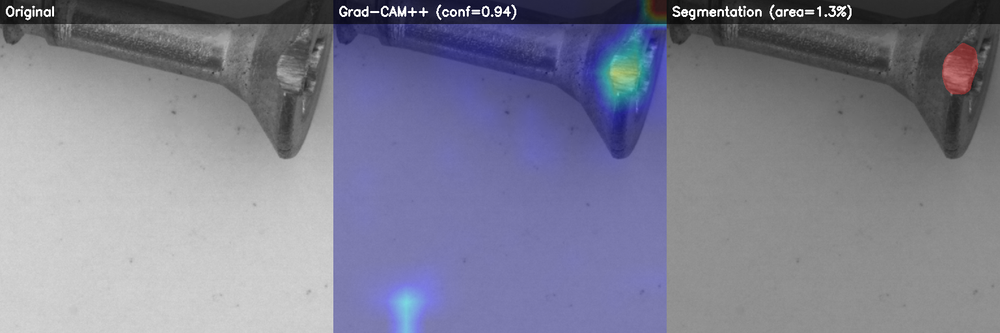
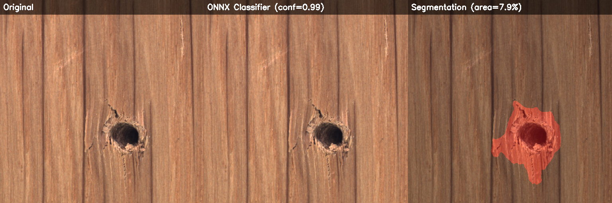
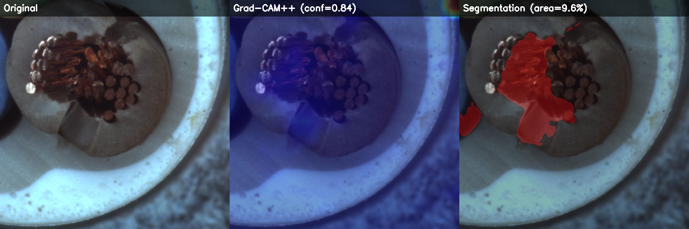

# NullDefect

NullDefect is an industrial visual defect detection project built around the MVTec AD dataset. It combines supervised classification, unsupervised anomaly detection, pixel-level segmentation, evaluation/reporting, SageMaker training launchers, ZenML orchestration, and FastAPI serving.

The codebase currently implements three complementary model paths:

- EfficientNet-B4 classifier for binary normal/defective classification.
- PatchCore with a WideResNet-50 backbone for category-specific anomaly detection.
- U-Net with an EfficientNet-B4 encoder for defect mask segmentation.

## Features

- DVC data pipeline for MVTec structure verification, tiling, image-level splits, and validation.
- PyTorch Lightning training entry points for classifier and segmenter.
- anomalib PatchCore training/evaluation wrapper for all 15 MVTec categories.
- MLflow logging for training and evaluation artifacts.
- SageMaker SDK v3 launcher for classifier, anomaly, and segmentation jobs.
- ZenML evaluation and inference pipelines.
- Grad-CAM++, calibration plots, Evidently HTML reports, and benchmark comparison utilities.
- FastAPI inference service with PyTorch checkpoint inference and optional ONNX classifier/segmenter inference.

## Prediction Examples

Example combined visualizations produced by the ONNX inference endpoint:

| Screw scratch head | Wood hole | Cable cut inner insulation |
|---|---|---|
|  |  |  |

## Repository Layout

```text
configs/                 YAML configuration for data, training, evaluation, quantization
data/                    Raw and processed datasets, usually DVC-managed
checkpoints/             Local model checkpoints and PatchCore artifacts
outputs/predictions/     Saved API prediction visualizations
pipelines/               ZenML and SageMaker pipeline entry points
reports/                 Evaluation plots, Grad-CAM images, Evidently reports, JSON summaries
src/data/                MVTec verification, tiling, splitting, validation, datasets, transforms
src/models/              Lightning classifier, PatchCore wrapper, Lightning segmenter
src/training/            Local/SageMaker-compatible training scripts
src/evaluation/          Metrics, calibration, Grad-CAM, report generation, evaluation CLI
src/serving/             FastAPI app and PyTorch/ONNX inference engines
steps/                   ZenML steps for evaluation and inference pipelines
zenml_stack/             Local ZenML stack setup script
src_package/             Mirrored source tree used as SageMaker source_dir
```

## Requirements

- Linux x86_64 is the configured `uv` target.
- Python `>=3.12,<3.13` according to `pyproject.toml`.
- CUDA is optional but recommended for training and evaluation.
- AWS CLI credentials are required only for SageMaker jobs.
- MVTec AD must be downloaded manually or via a Kaggle mirror before running the data pipeline.
- Optional report and ONNX serving paths require packages that are imported lazily by the code, such as `evidently` and `onnxruntime`.

Install dependencies with `uv`:

```bash
uv sync
```

Or with pip:

```bash
python -m venv .venv
source .venv/bin/activate
pip install -r requirements.txt
pip install -e .
```

Install optional extras when needed:

```bash
pip install evidently onnxruntime
```

## Dataset Setup

MVTec AD requires license acceptance. Download it from the official site or a Kaggle mirror, then place the extracted category folders under:

```text
data/raw/mvtec/
```

Expected structure:

```text
data/raw/mvtec/bottle/train/good/*.png
data/raw/mvtec/bottle/test/good/*.png
data/raw/mvtec/bottle/test/<defect_type>/*.png
data/raw/mvtec/bottle/ground_truth/<defect_type>/*_mask.png
```

The configured categories are the 15 MVTec AD classes: `bottle`, `cable`, `capsule`, `carpet`, `grid`, `hazelnut`, `leather`, `metal_nut`, `pill`, `screw`, `tile`, `toothbrush`, `transistor`, `wood`, and `zipper`.

## Data Pipeline

Run all DVC stages:

```bash
dvc repro
```

Run stages manually:

```bash
python src/data/download.py
python src/data/tile.py
python src/data/split.py
python src/data/validate.py
python src/data/dataset.py
```

The DVC pipeline is defined in `dvc.yaml`:

- `verify`: checks that `data/raw/mvtec` has the expected category structure.
- `tile`: creates 512x512 overlapping patches from raw images and masks.
- `split`: creates image-level train/val/test splits to prevent patch leakage.
- `validate`: checks metadata schema, file existence, split coverage, class balance, category coverage, readability, and patch size.

Important outputs:

```text
data/processed/patches/                  tiled image and mask patches
data/processed/splits/train.csv          training split
data/processed/splits/val.csv            validation split
data/processed/splits/test.csv           test split
data/processed/metadata/dataset_metadata.csv
data/processed/metadata/tiling_stats.json
data/processed/metadata/validation_report.json
```

## Training

Training scripts read their hyperparameters from `configs/` and are written to run locally or inside SageMaker containers.

Classifier:

```bash
python src/training/train_classifier.py
python src/training/train_classifier.py --fast-dev-run
```

Anomaly detection:

```bash
python src/training/train_anomaly.py
python src/training/train_anomaly.py --category bottle
```

Segmentation:

```bash
python src/training/train_segmentation.py
python src/training/train_segmentation.py --fast-dev-run
```

Training outputs are written under `checkpoints/` by default:

- `checkpoints/classifier/`
- `checkpoints/anomaly/`
- `checkpoints/segmentation/`

MLflow defaults to local file tracking under `mlruns` unless `MLFLOW_TRACKING_URI` is set.

## SageMaker Training

The SageMaker launcher is `pipelines/sagemaker_training.py`. It syncs processed data to S3, packages `src_package` as the source directory, and submits a SageMaker SDK v3 `ModelTrainer` job.

Required environment variables:

```bash
export SAGEMAKER_S3_BUCKET=<your-bucket>
export SAGEMAKER_ROLE_ARN=<your-sagemaker-role-arn>
export AWS_DEFAULT_REGION=eu-central-1
```

Dry run:

```bash
python pipelines/sagemaker_training.py --model classifier --dry-run
```

Submit jobs:

```bash
python pipelines/sagemaker_training.py --model classifier
python pipelines/sagemaker_training.py --model anomaly
python pipelines/sagemaker_training.py --model segmentation
```

The model-specific SageMaker settings live in:

- `configs/train_classifier.yaml`
- `configs/train_anomaly.yaml`
- `configs/train_segmentation.yaml`

## Evaluation

The direct evaluation CLI is `src/evaluation/evaluate.py`. It can evaluate one model or all models, generate plots/reports, and log metrics/artifacts to MLflow.

Run full evaluation:

```bash
python src/evaluation/evaluate.py
```

Run a faster classifier check without Grad-CAM:

```bash
python src/evaluation/evaluate.py --model classifier --skip-gradcam
```

Run a single model:

```bash
python src/evaluation/evaluate.py --model anomaly
python src/evaluation/evaluate.py --model segmentation
```

Evaluation configuration is in `configs/evaluate.yaml`. Outputs go to `reports/`:

- `reports/evaluation_results.json`
- `reports/gradcam/`
- `reports/plots/`
- `reports/evidently/`

## ZenML Pipelines

Set up the local ZenML stack once:

```bash
python zenml_stack/setup_stack.py
zenml up
```

Run the ZenML evaluation pipeline:

```bash
python pipelines/evaluation_pipeline.py
```

Useful overrides:

```bash
python pipelines/evaluation_pipeline.py --device cpu --no-cache
python pipelines/evaluation_pipeline.py \
  --classifier-ckpt checkpoints/classifier/<checkpoint>.ckpt \
  --segmentation-ckpt checkpoints/segmentation/<checkpoint>.ckpt
```

Run the ZenML single-image inference pipeline:

```bash
python pipelines/inference_pipeline.py --image path/to/image.png --device cpu
```

## Serving

Start the FastAPI server:

```bash
uvicorn src.serving.app:app --host 0.0.0.0 --port 8000 --reload
```

The server auto-detects checkpoints under `checkpoints/classifier`, `checkpoints/segmentation`, and `checkpoints/anomaly`. You can also set explicit paths:

```bash
export CLASSIFIER_CKPT=checkpoints/classifier/<checkpoint>.ckpt
export SEGMENTER_CKPT=checkpoints/segmentation/<checkpoint>.ckpt
export ANOMALY_ROOT=checkpoints/anomaly
export ANOMALY_CATEGORY=bottle
export INFERENCE_DEVICE=cpu
```

Endpoints:

- `GET /health`: service and model loading status.
- `POST /predict`: PyTorch checkpoint inference for one uploaded image.
- `POST /predict/batch`: PyTorch checkpoint inference for up to 32 uploaded images.
- `POST /predict/path`: server-side image path inference.
- `POST /predict/onnx`: ONNX classifier/segmenter inference with PatchCore checkpoint anomaly scoring or classifier-proxy fallback.
- `GET /docs`: Swagger UI.

Example request:

```bash
curl -X POST http://localhost:8000/predict \
  -F "file=@data/raw/mvtec/bottle/test/broken_large/000.png"
```

Prediction responses include classification, anomaly score, segmentation mask, Grad-CAM/combined visualizations as base64 PNG strings, and metadata. Combined visualizations are also saved to `outputs/predictions/` by default. Override with `PREDICTIONS_SAVE_DIR`.

For ONNX inference, place ONNX files under `checkpoints/` or set:

```bash
export ONNX_CLASSIFIER_PATH=checkpoints/quantized/classifier/model.onnx
export ONNX_SEGMENTER_PATH=checkpoints/quantized/segmentation/model.onnx
```

## Configuration Files

- `configs/data.yaml`: dataset categories, paths, tiling, split ratios, augmentation, dataloader defaults.
- `configs/train_classifier.yaml`: EfficientNet-B4 model, focal loss, scheduler, checkpointing, SageMaker settings.
- `configs/train_anomaly.yaml`: PatchCore backbone/layers, coreset ratio, neighbors, evaluation metrics, SageMaker settings.
- `configs/train_segmentation.yaml`: U-Net encoder, Dice+BCE loss, scheduler, checkpointing, SageMaker settings.
- `configs/evaluate.yaml`: checkpoint paths, report directories, thresholds, Grad-CAM/calibration settings.
- `configs/quantization.yaml`: PTQ/QAT/ONNX/benchmark settings for quantization workflows.

## Development Notes

- `src/` is the primary local source tree used by scripts and APIs.
- `src_package/` mirrors source files for SageMaker `source_dir` packaging.
- There is no dedicated pytest suite in the repository at the moment; use the script-level smoke tests such as `python src/data/dataset.py`, `python src/models/classifier.py`, and `--fast-dev-run` training commands.
- `configs/quantization.yaml` and ONNX serving support are present, but no standalone quantization/export script is currently present in the repository.
- The root `main.py` is only a placeholder and is not the application entry point.

## Typical End-to-End Flow

```bash
uv sync
python src/data/download.py
dvc repro
python src/data/dataset.py
python src/training/train_classifier.py --fast-dev-run
python src/training/train_segmentation.py --fast-dev-run
python src/training/train_anomaly.py --category bottle
python src/evaluation/evaluate.py --skip-gradcam
uvicorn src.serving.app:app --host 0.0.0.0 --port 8000
```
